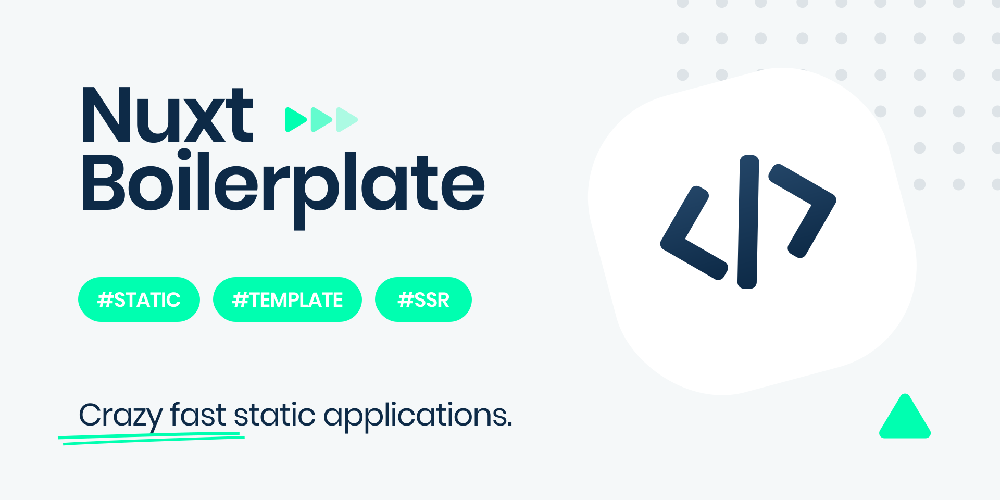

<p align="center">
    
</p>
<h1 >Nuxt Static Boilerplate</h1>
A well-organized Nuxt template for creating fast static applications.

## Features

- Speeds up your `productivity` 🚀
- Includes `advanced` settings ready for production ✨
- Provides `pre-configured` modules and custom components 📦
- Eliminates initial setup and `simplifies` development process 🔥
- Offers you powerful built-in solutions such as `lazy-loading`, `font-preloading`, `global data`, `SEO` etc. 💪
- Supports modern workflow and build tools like `prettier`, `eslint`, `stylelint` etc. ⚙️
- Helps you `organize` files and folders with an updated structure 📁
- Comes with integrated `Nevo` framework

## Quick Start

1. Clone this repo to your working directory:

```sh
$ git clone https://github.com/ivodolenc/nuxt-static-boilerplate.git <project-name>
```

2. Move to the project directory:

```sh
$ cd <project-name>
```

3. Install all dependencies:

```sh
$ npm install # or yarn
```

That's it! Start developing your app ✨

## Documentation

Project details can be found in the 📘 [docs](docs/README.md) folder.

## License

**Nuxt Static Boilerplate**

[MIT License](LICENSE)

Copyright (c) Ivo Dolenc
